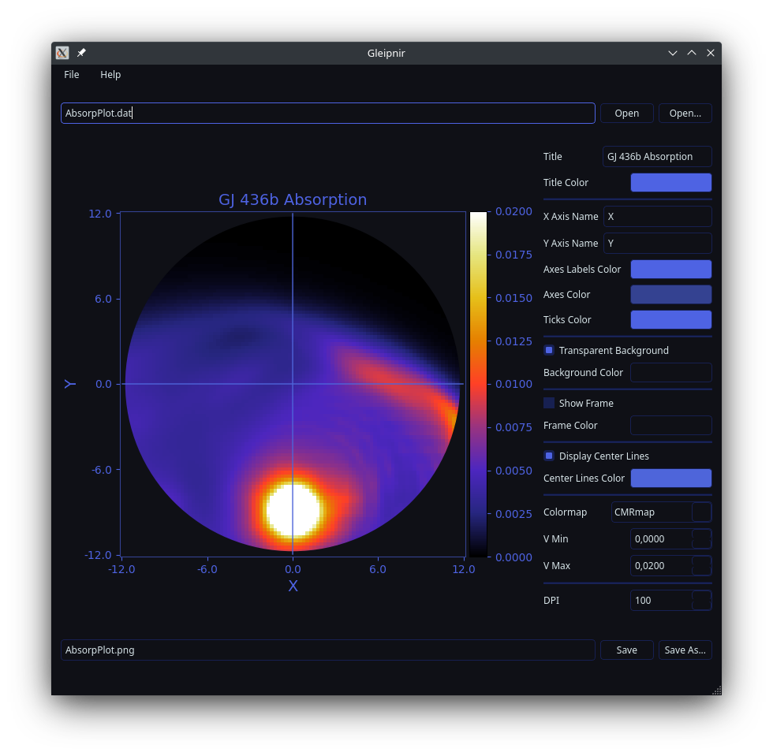

# Gleipnir

## Description

Gleipnir is a program with graphical user interface for visualizing the results of modeling the absorption of radiation by stellar and planetary matter.



Compatible file format for parsing (commonly named as "AbsorpPlot.dat"):

```
nR <int>
nZ <int>
dr <float>
dz <float>
r0 <float>
z0 <float>
V1 <float>
V2 <float>
dV <float>
Incl <float>
ENA <float>
Coeff <float>
arrays
AbsPlot
<float values from 0.0 to 1.0 with size (nR + 1) x (nZ + 1), each value separated by space>
<empty string>
```

## Installation

### Method 1: Python Package (GNU/Linux, Windows)

If you want to install Gleipnir as independent application, it is recommended to use [pipx](https://pypa.github.io/pipx/).

```sh
pipx install exoplanet-gleipnir
```

> Additionally, you can create application shortcut:
> On GNU/Linux (XDG-compatible desktop environment) run:
> ```sh
> echo "[Desktop Entry]\nName=Gleipnir\nExec=$PIPX_BIN_DIR/gleipnir\nType=Application\nTerminal=false" > ~/.local/share/applications; cp ~/.local/share/applications/Gleipnir.desktop ~/Desktop
> ```
> On Windows run (use PowerShell):
> ```sh
> $shortcut = (New-Object -COM WScript.Shell).CreateShortcut('$env:UserProfile\Desktop\Gleipnir.lnk'); $shortcut.TargetPath='$env:PIPX_BIN_DIR\gleipnir.exe'; $shortcut.Save()
> ```

You can also install Gleipnir using [pip](https://pip.pypa.io/en/stable/).

```sh
pip install exoplanet-gleipnir
```

> Application shortcut creation instruction:
> On GNU/Linux (XDG-compatible desktop environment) run:
> ```sh
> echo "[Desktop Entry]\nName=Gleipnir\nExec=python -m gleipnir\nType=Application\nTerminal=false" > ~/.local/share/applications; cp ~/.local/share/applications/Gleipnir.desktop ~/Desktop
> ```
> On Windows run (use PowerShell):
> ```sh
> $shortcut = (New-Object -COM WScript.Shell).CreateShortcut('$env:UserProfile\Desktop\Gleipnir.lnk'); $shortcut.TargetPath='python.exe -m gleipnir'; $shortcut.Save()
> ```

### Method 2: Scoop (Windows)

To install Gleipnir with [Scoop](https://scoop.sh/), you can add repo and install this program.

```sh
scoop bucket add shell https://github.com/deverte/scoop-shell
```

```sh
scoop install gleipnir
```

### Method 3: Download (Windows)

Also you can [download](https://github.com/deverte/gleipnir/releases) a single executable file (`gleipnir.exe`) and use it like portable program.

## Dependencies

- [Matplotlib](https://matplotlib.org/)
- [PyQt](https://www.riverbankcomputing.com/software/pyqt/intro)
- [libsass-python](https://github.com/sass/libsass-python)

## Build Instructions

Development requires:

1. [Poetry](https://python-poetry.org/).
2. [7-Zip](https://www.7-zip.org/) (optional, for Windows Scoop package creation).
3. [git](https://git-scm.com/) (optional, but recommended).
4. [libsass-python](https://github.com/sass/libsass-python) (optional, for styles preprocessing).
5. [PyInstaller](https://github.com/pyinstaller/pyinstaller) (optional, for Windows executable creation).

First steps:

1. Download Gleipnir sources:
    ```sh
    git clone https://github.com/deverte/gleipnir
    ```
2. Install dependencies:
    ```sh
    poetry install
    ```

> If styles are updated, it's also needed to preprocess the `scss` file:
> 
> ```sh
> poetry run pysassc style/dark_theme.scss gleipnir/ui/dark_theme.qss
> ```

### Python Package

The following command will build a package as a sdist (source tarball) and a wheel (compiled):

```sh
poetry build
```

The resulting `gleipnir-x.x.x-py3-none-any.whl` and `gleipnir-x.x.x.tar.gz` packages will be in `dist` directory.

### Windows Executable

The following command will build a single portable executable:

```sh
poetry run pyinstaller -F --add-data "gleipnir/ui/main.ui;gleipnir/ui" --add-data "gleipnir/ui/dark_theme.qss;gleipnir/ui" --hidden-import "gleipnir.ui.file_line_edit.view" --hidden-import "gleipnir.ui.color_button.view" --clean --noconfirm --windowed gleipnir/__main__.py --name gleipnir
```

The resultint `gleipnir.exe` will be in `dist` directory.

> For the Scoop, it's also needed to compress the resulting `gleipnir.exe` file into a zip archive.
>
> ```sh
> 7z a dist/gleipnir.zip dist/gleipnir.exe
> ```

## Testing Instructions

You can run application inside development environment with the following command:

```sh
poetry run python -B -m gleipnir
```

## License

[GPLv3](LICENSE)